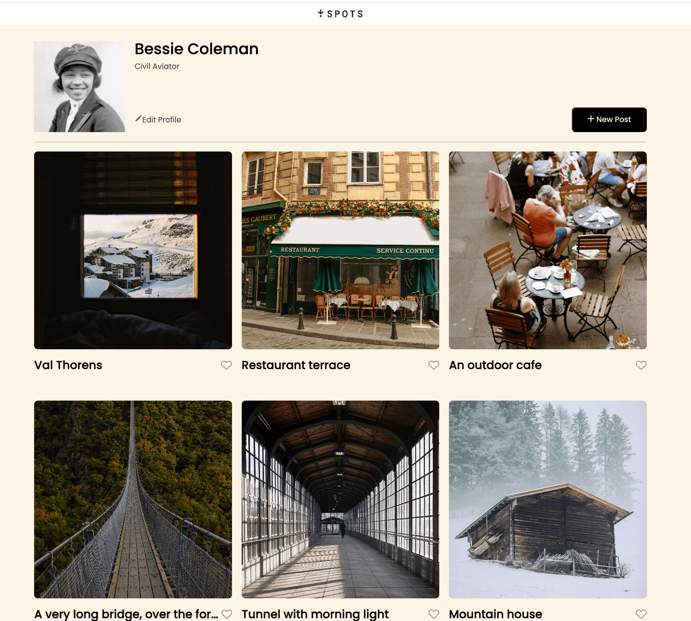

# Project 3: Spots

# Spots – Stage 2 Responsive Webpage

## Project Description

Spots is a responsive image-sharing webpage where users can view profile information and a grid of photo cards.  
In this stage of the project, the focus was on building a fully responsive layout that adapts to desktop and mobile screen sizes.

The page includes a user profile section and a grid of cards that adjust automatically based on the screen width.

---

## Functionality

- Responsive layout for desktop and mobile
- Profile section with avatar, name, and description
- Grid of photo cards
- Hover states for interactive elements

---

## Technologies and Techniques Used

- HTML
- CSS
- Flexbox
- CSS Grid
- Media queries
- BEM methodology
- Responsive design principles
- Text overflow techniques (ellipsis and line clamp)

---

## Screenshot Desktop Version

## Project link

Github Link (https://github.com/breezewelchs/se_project_spots/settings/pages)
